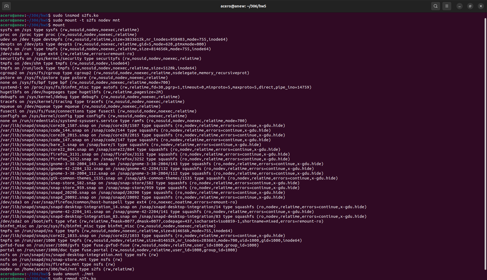
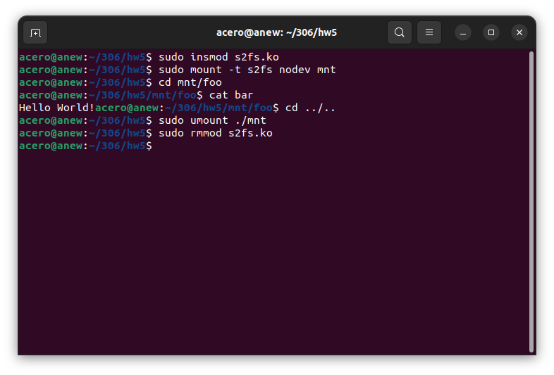

# s2fs -- Super Simple File System

Simple pseudo file system module developed for the Linux kernel written in C. It showcases the implementation of basic file system operations, including the creation of inodes, directories, and files, within a Linux module. The module features a simple file system with basic functionalities, such as reading from and writing to files, and the ability to create directories and files.

## Build and Run

### Prerequisites

- A Linux environment with kernel headers installed.
- GCC (GNU Compiler Collection) for compiling the C code.
- Root access to load kernel modules.

The associated Makefile supports targets: 'all', 'clean', 'install', and 'uninstall'.
'install' installs the module into the kernel, and will create a directory 'mnt'.

## Repository Images

*Figure 1: Mounted file systems*

*Figure 2: Reading file bar from the file system*

